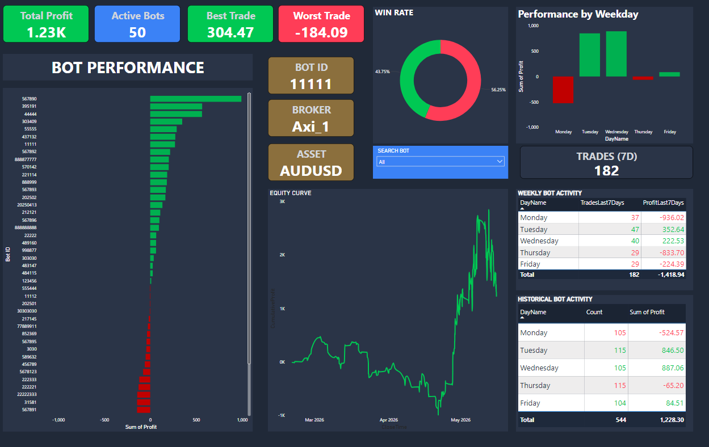
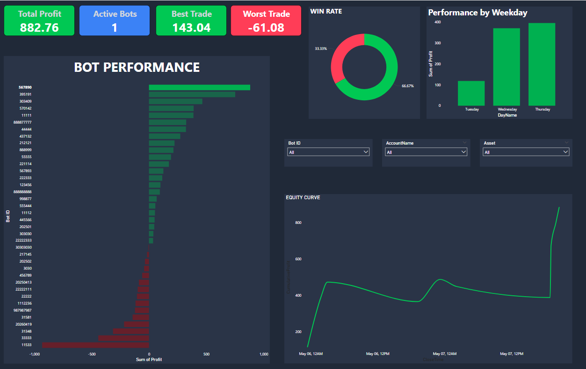

# MacroTrading Bot Analytics Dashboard

Interactive Power BI dashboard designed to analyze trading bot performance, profitability, win rate, and equity growth over time.

---

## Dashboard Overview

This project focuses on analyzing automated trading systems using interactive business intelligence techniques in Power BI.

The dashboard allows users to:

* Monitor total trading profitability
* Analyze bot performance rankings
* Visualize winning vs losing trade ratios
* Track equity curve evolution over time
* Evaluate profitability by weekday
* Filter results dynamically by Bot ID, Broker, and Asset

---

## Key Features

* Interactive filtering system
* Dynamic Equity Curve visualization
* Win Rate donut analysis
* Profitability ranking by bot
* Weekday performance analysis
* Dark-theme professional dashboard design

---

## Tools & Technologies

* Power BI
* Power Query
* DAX
* Data Modeling
* Financial Analytics

---

## Skills Demonstrated

* Data Cleaning
* Data Visualization
* DAX Measures
* Dashboard Design
* Interactive Reporting
* Financial Data Analysis
* Exploratory Analytics

---

## Dashboard Preview

### Full Dashboard Overview

Interactive overview showing global bot performance, win rate, equity curve, and weekday profitability analysis.

---

### Best Performing Bot Analysis

Focused analysis of the top-performing trading bot, including profitability behavior, win rate, and equity growth.

---

## Insights Generated

* Certain bots showed strong profitability but low trading frequency.
* Thursday displayed the highest overall profitability.
* The equity curve revealed periods of drawdown followed by strong recovery.
* Win rate analysis helped identify unstable trading systems.

---

## Project Status

Completed — Version 1.0

Future improvements may include:

* Multi-page navigation
* Advanced DAX analytics
* Drawdown metrics
* Monthly performance analysis
* Advanced tooltip interactions
